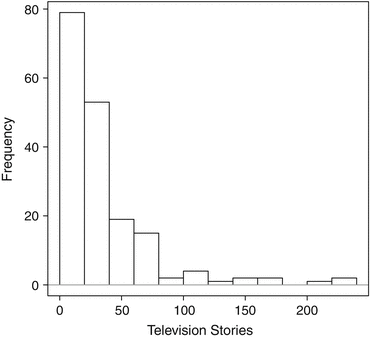
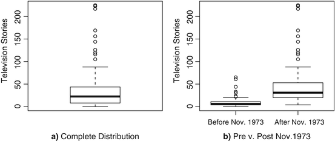
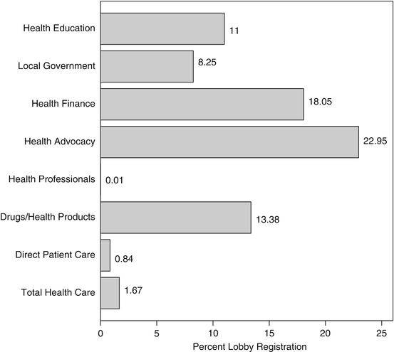
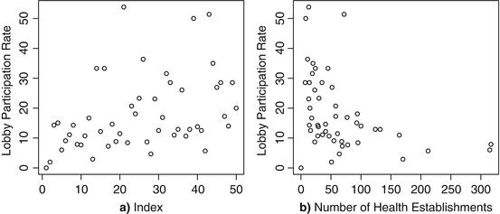
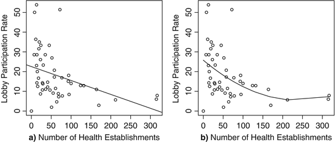

# Visualización de datos  {#Visualizaciondedatos}

```{r, eval=knitr::opts_knit$get("rmarkdown.pandoc.to") == "html", results='asis', echo=FALSE}
cat('<hr style="background-color:#03193b;height:2px">')
```

Palabras clave:
- Marco de datos 
- Noticias televisivas 
- Paquete de celosía 
- Finanzas de salud 
- Función de gráfico 

La presentación visual de datos y los resultados de los modelos se ha convertido en una pieza central del análisis político moderno. Muchas de las principales revistas de Ciencias Políticas, incluida la *Revista Estadounidense de Ciencias Políticas*, ahora solicitan gráficas en lugar de tablas siempre que ambas puedan transmitir la misma información. De hecho, Kastellec y Leoni (2007) argumentan que las gráficas transmiten resultados empíricos mejor que las tablas. Cleveland (1993) y Tufte (2001) escribió dos de los volúmenes principales que describen los elementos de una buena visualización cuantitativa, y Yau (2011) ha producido una versión más reciente de la representación gráfica. Básicamente, estos trabajos sirven como manuales de estilo para gráficos^[Otras figuras históricas particularmente clave en el desarrollo de medidas gráficas incluyen Halley (1686), Juega limpio (1786/2005) y Tukey (1977). Beniger y Robyn presentan una historia más completa (1978).]. Más allá de las sugerencias que estos académicos ofrecen por el bien de los lectores, ver los propios datos visualmente transmite información sustancial sobre las características univariadas, bivariadas y multivariadas de los datos: ¿Una variable parece sesgada? ¿Parecen correlacionarse sustancialmente dos variables? ¿Cuál es la relación funcional adecuada entre variables? ¿Cómo cambia una variable en el espacio o en el tiempo? Responder estas preguntas por uno mismo como analista y por el lector en general puede elevar la calidad del análisis presentado a la disciplina.

En el límite de este movimiento gráfico en el análisis cuantitativo, **R**  ofrece visualización de modelos y datos de última generación. Muchos de los programas estadísticos comerciales han intentado durante años ponerse al día con las capacidades gráficas de **R** . Este capítulo muestra estas capacidades, pasando primero a la función <code>plot</code> que está disponible automáticamente como parte del paquete <code>base</code>. En segundo lugar, analizamos algunos de los otros comandos de gráficos que se ofrecen en la biblioteca <code>base</code>. Finalmente, pasamos a la biblioteca <code>lattice</code> (o celosía), que permite al usuario crear Trellis Graphics, un marco de visualización desarrollado por Becker, Cleveland y otros para poner las sugerencias de Cleveland (1993) en la práctica. Aunque el espacio no lo permite aquí, también se anima a los usuarios a buscar los paquetes <code>ggplot2</code>, que ofrecen opciones de gráficos adicionales. Chang (2013), en particular, ofrece varios ejemplos de gráficos con <code>ggplot2</code>.

En este capítulo, trabajamos con dos conjuntos de datos de ejemplo. El primero es sobre el cabildeo en salud en los 50 estados estadounidenses, con un enfoque específico en la proporción de empresas de la industria financiera de la salud que están registradas para cabildear (Lowery et al. 2008). Una variable de predicción clave es el número total de firmas financieras de salud abiertas al público, que incluye organizaciones que brindan planes de salud, servicios comerciales, coaliciones de empleadores de salud y seguros. El conjunto de datos también incluye la tasa de participación de los grupos de presión por estado, o el número de grupos de presión como una proporción del número de empresas, no solo en el financiamiento de la salud sino para todas las empresas relacionadas con la salud y en otras seis subáreas. Estos son datos transversales del año 1997. La lista completa de variables es la siguiente:

- **stno**: Índice numérico de 1 a 50 que ordena los estados alfabéticamente.
- **raneyfolded97**: Índice de Ranney plegado de la competencia estatal bipartita en 1997^[Nebraska y Carolina del Norte son observaciones faltantes del índice de Ranney.].
- **healthagenda97**: Número de proyectos de ley relacionados con la salud considerados por la legislatura estatal en 1997.
- **supplybusiness**: Número de establecimientos de financiación sanitaria.
- **businesssupplysq**: Número de establecimientos de financiación sanitaria al cuadrado.
- **partratebusness**: Tasa de participación en el lobby para el financiamiento de la salud: número de registros como porcentaje del número de establecimientos.
- **predecirbuspartrate**: Predicción de la tasa de participación en el financiamiento de la salud como función cuadrática del número de establecimientos de financiamiento de la salud. (Sin variables de control en la predicción).
- **partratetotalhealth**: Tasa de participación en el lobby para toda la atención médica (incluidas siete subáreas).
- **partratedpc**: Tasa de participación en el lobby para la atención directa al paciente.
- **partratepharmprod**: Tasa de participación en el lobby de medicamentos y productos sanitarios.
- **partrateprofessionals**: Tasa de participación de los profesionales de la salud en el lobby.
- **partrateadvo**: Tasa de participación del lobby para la promoción de la salud.
- **partrategov**: Tasa de participación en el lobby del gobierno local.
- **rnmedschoolpartrate**: Tasa de participación de los grupos de presión para la educación sanitaria.

En segundo lugar, analizamos las de Peake y Eshbaugh-Soha (2008) datos sobre el número de noticias de televisión relacionadas con la política energética en un mes determinado. En este marco de datos, las variables son:
- **Date**: Vector de caracteres del mes y año observado.
- **Energy**: Número de historias relacionadas con la energía transmitidas en los noticieros de televisión nocturnos por mes.
- **Unemploy**: La tasa de desempleo por mes.
- **Approval**: Aprobación presidencial por mes.
- **oilc**: Precio del petróleo por barril.
- **freeze1**: Variable indicadora codificada con 1 durante los meses de agosto a noviembre de 1971, cuando se impusieron congelaciones de precios y salarios. Codificado 0 en caso contrario.
- **freeze2**: Variable indicadora codificada con 1 durante los meses de junio a julio de 1973, cuando se impusieron los precios, salarios y congelaciones de precios. Codificado 0 en caso contrario.
- **embargo**: Una variable indicadora codificada con 1 durante los meses de octubre de 1973 a marzo de 1974, durante el embargo petrolero árabe. Codificado 0 en caso contrario.
- **rehenes**: Una variable indicadora codificada con 1 durante los meses de noviembre de 1979 a enero de 1981, durante la crisis de los rehenes en Irán. Codificado 0 en caso contrario.
- **Presidential speeches**: Los indicadores adicionales se codifican como 1 durante el mes en que un presidente pronunció un discurso importante sobre política energética y 0 en caso contrario. Los indicadores de los discursos respectivos se denominan: **rmn1173**, **rmn1173a**, **grf0175**, **grf575**, **grf575a**, **jec477**, **jec1177**, **jec479**, **grf0175s**, **jec479s** y **jec477s**.

## Gráficos univariados en el paquete <code>base</code> {-}

Como un primer vistazo a nuestros datos, mostrar una sola variable gráficamente puede transmitir un sentido de la distribución de los datos, incluyendo su modo, dispersión, sesgo y curtosis. La biblioteca de <code>lattice</code> en realidad ofrece algunos comandos más para la visualización univariante que la <code>base</code>, pero comenzamos con los principales comandos univariados incorporados. La mayoría de los comandos de gráficos en el paquete base llaman a la función <code>plot</code>, pero <code>hist</code> y <code>boxplot</code> son excepciones notables.

El comando <code>hist</code> es útil para simplemente tener una idea de la frecuencia relativa de varios valores comunes. Comenzamos cargando nuestros datos sobre la cobertura de noticias televisivas sobre política energética. Luego creamos un **hist**ograma de esta serie temporal de conteos mensuales de historias con el comando <code>hist</code>. Primero, descargue los datos de Peake y Eshbaugh-Soha sobre cobertura de pólizas de energía, el archivo llamado <code>PESenergy.csv</code>. El archivo está disponible en el Dataverse nombrado en la página vii o en el enlace de contenido del capítulo en la página 33. Es posible que deba usar <code>setwd</code> para apuntar **R** a la carpeta donde ha guardado los datos. Después de esto, ejecute el siguiente código:

```{r, warning=F, message=F}
pres.energy<-read.csv("PESenergy.csv")

hist(pres.energyEnergy,xlab="Television Stories",main="")

abline(h=0,col=’gray60’)

box()
```

El resultado que produce este código se presenta en la figura  3.1 . En este código, comenzamos leyendo Peake y Eshbaugh-Soha (2008) datos. El archivo de datos en sí es un archivo de valores separados por comas con una fila de encabezado de nombres de variables, por lo que los valores predeterminados de <code>read.csv</code> se adaptan a nuestros propósitos. Una vez que se cargan los datos, trazamos un histograma de nuestra variable de interés usando el comando <code>hist</code>: **pres.energy$Energy** llama a la variable de interés desde su marco de datos. Usamos la opción <code>xlab</code>, que nos permite definir la etiqueta que  imprime **R** en el eje horizontal. Dado que este eje nos muestra los valores de la variable, simplemente deseamos ver la frase “Historias de televisión”, describiendo brevemente lo que significan estos números. El opción <code>main</code> define un título impreso en la parte superior de la figura. En este caso, la única forma de imponer un título en blanco es incluir citas sin contenido entre ellas. Una característica interesante de graficar en el paquete <code>base</code> es que algunos comandos pueden agregar información adicional a una gráfica que ya se ha dibujado. El comando <code>abline</code> es una herramienta flexible y útil. (El nombre **a-bline** se refiere a la fórmula lineal $y  =  a + bx$. Por lo tanto, este comando puede dibujar líneas con una pendiente y la intersección, o se puede dibujar una línea horizontal o vertical). En este caso, <code>abline</code> agrega un horizontal línea a lo largo del punto 0 en el eje vertical, por lo tanto $h = 0$. Esto se agrega para aclarar dónde está la base de las barras en la figura. Finalmente, el comando <code>box()</code> encierra la figura completa en un cuadro, a menudo útil en artículos impresos para aclarar dónde termina el espacio gráfico y comienza el otro espacio en blanco. Como muestra el histograma, hay una fuerte concentración de observaciones en 0 y justo por encima de 0, y un claro sesgo positivo en la distribución. (De hecho, estos datos se vuelven a analizar en Fogarty y Monogan (2014) precisamente para abordar algunas de estas características de datos y discutir los medios útiles de analizar los recuentos de medios dependientes del tiempo).

<center></center>
**Figura 3.1** Histograma del recuento mensual de noticias de televisión relacionadas con la energía

Otro gráfico univariado es un diagrama de caja y bigotes. **R**  nos permite obtener esto únicamente para la variable única, o para un subconjunto de la variable basado en alguna otra medida disponible. Primero dibujando esto para una sola variable:

```{r, warning=F, message=F}
boxplot(pres.energy$Energy,ylab="Television Stories")
```

El resultado de esto se presenta en el panel (a) de la Fig.  3.2 . En este caso, los valores de los recuentos mensuales están en el eje vertical; por lo tanto, usamos la opción <code>ylab</code> para etiquetar el eje vertical (o el eje y **label**) apropiadamente. En la figura, la parte inferior del cuadro representa el valor del primer cuartil (percentil 25), la línea sólida grande dentro del cuadro representa el valor mediano (segundo cuartil, percentil 50) y la parte superior del cuadro representa el valor del tercer cuartil ( Percentil 75). Los bigotes, por defecto, se extienden a los valores más bajos y más altos de la variable que no son más de 1,5 veces el rango intercuartílico (o la diferencia entre el tercer y el primer cuartil) fuera de la caja. El propósito de los bigotes es transmitir el rango sobre el que cae la mayor parte de los datos. Los datos que quedan fuera de este rango se representan como puntos en sus valores respectivos. Esta gráfica de caja se ajusta a nuestra conclusión del histograma: los valores pequeños, incluido 0, son comunes y los datos tienen un sesgo positivo.

<center></center>
**Figura 3.2** Tramas de caja y bigotes de la distribución del recuento mensual de nuevas historias televisivas relacionadas con la energía. El panel ( a ) muestra la distribución completa y el panel ( b ) muestra las distribuciones para los subconjuntos antes y después de noviembre de 1973

Los diagramas de caja y bigotes también pueden servir para ofrecer una idea de la distribución condicional de una variable. Para nuestra serie temporal de cobertura de la política energética, el primer evento importante que observamos es el discurso de Nixon de noviembre de 1973 sobre el tema. Por lo tanto, podríamos crear un indicador simple donde los primeros 58 meses de la serie (hasta octubre de 1973) se codifican con 0 y los 122 meses restantes de la serie (desde noviembre de 1973 en adelante) se codifican con 1. Una vez que hacemos esto, el comando <code>boxplot</code> nos permite condicionar sobre una variable:

```{r, warning=F, message=F}
pres.energy$post.nixon<-c(rep(0,58),rep(1,122))

boxplot(pres.energy$Energy~pres.energy$post.nixon,

     axes=F,ylab="Television Stories")

axis(1,at=c(1,2),labels=c("Before Nov. 1973",

     "After Nov. 1973"))

axis(2)

box()
```

Esta salida se presenta en el panel (b) de la figura  3.2 . La primera línea de código define nuestra variable anterior a posterior a noviembre de 1973. Observe aquí que nuevamente definimos un vector con  <code>c</code>. Dentro de <code>c</code>, usamos el comando <code>rep</code> (para **repeat**). Entonces <code>rep(0,58)</code> produce 58 ceros y <code>rep(1,122)</code> produce 122 unidades. La segunda línea dibuja nuestras gráficas de caja , pero agregamos dos advertencias importantes relativas a nuestra última llamada a la <code>boxplot</code>: Primero, enumeramos <code>pres.energy$Energy~pres.energy$post.nixon</code> como nuestro argumento de datos. El argumento antes de la tilde (<code>~</code>) es la variable para la que queremos la distribución, y el argumento posterior es la variable condicionante. En segundo lugar, agregamos el comando <code>axes = F</code>. (También podríamos escribir <code>axes = FALSE</code>, pero **R**  acepta <code>F</code> como abreviatura). Esto nos da más control sobre cómo se presentan los ejes horizontal y vertical. En el comando siguiente, agregamos el eje 1 (el eje horizontal inferior), agregando etiquetas de texto en las marcas de verificación 1 y 2 para describir los valores de la variable condicionante. Luego, agregamos el eje 2 (el eje vertical izquierdo) y un cuadro alrededor de toda la figura. Panel (b) de la figura  3.2muestra que la distribución antes y después de esta fecha es fundamentalmente diferente. Los valores mucho más pequeños persisten antes del discurso de Nixon, mientras que hay una media más grande y una mayor dispersión de valores después. Por supuesto, esto es solo un primer vistazo y el efecto del discurso de Nixon se confunde con una variedad de factores, como el precio del petróleo, la aprobación presidencial y la tasa de desempleo, que contribuyen a esta diferencia.

### Gráficos de barras {-}

Los gráficos de barras pueden ser útiles siempre que queramos ilustrar el valor que toman algunas estadísticas para una variedad de grupos, así como para visualizar las proporciones relativas de datos medidos nominales u ordinalmente. Para ver un ejemplo de gráficos de barras, pasamos ahora al otro conjunto de datos de ejemplo de este capítulo, sobre el cabildeo por la salud en los 50 estados estadounidenses. Lowery y col. ofrecer un gráfico de barras de los promedios en todos los estados de la tasa de participación en el cabildeo, o el número de cabilderos como porcentaje del número de empresas, para todos los cabilderos de la salud y para siete subgrupos de cabilderos de la salud (2008, Fig. 3). Podemos recrear esa figura en **R**  tomando las medias de estas ocho variables y luego aplicando la función de **barplot** al conjunto de medias. Primero debemos cargar los datos. Para hacer esto, descargue los datos de Lowery et al. Sobre cabildeo, el archivo llamado <code>constructionData.dta</code> . El archivo está disponible en el Dataverse nombrado en la página vii o en el enlace de contenido del capítulo en la página 33. De nuevo, es posible que deba usar <code>setwd</code> para apuntar **R** a la carpeta donde ha guardado los datos. Dado que estos datos están en formato Stata, debemos usar la biblioteca <code>foreign</code> y luego el comando <code>read.dta</code>:

```{r, warning=F, message=F}
library(foreign)

health.fin<-read.dta("constructionData.dta")
```

Para crear la figura real en sí, podemos crear un subconjunto de nuestros datos que solo incluya los ocho predictores de interés y luego usar la función de <code>apply</code> para obtener la media de cada variable.

```{r, warning=F, message=F}
part.rates<-subset(health.fin,select=c(

     partratetotalhealth,partratedpc,

     partratepharmprod,partrateprofessionals,partrateadvo,

     partratebusness,partrategov,rnmedschoolpartrate))

lobby.means<-apply(part.rates,2,mean)

names(lobby.means)<-c("Total Health Care",

     "Direct Patient Care","Drugs/Health Products",

     "Health Professionals","Health Advocacy","

     Health Finance","Local Government","Health Education")
```

En este caso, <code>part.rates</code> es nuestro marco de datos subconjunto que solo incluye las ocho tasas de interés de participación del lobby. En la última línea, el comando **apply** permite tener un marco de matriz o de datos (<code>part.rates</code>) y aplicar una función de interés (<code>mean</code>) a cualquiera de las filas o las columnas de la trama de datos. Queremos la media de cada variable y las columnas de nuestro conjunto de datos representan las variables. El **2**, que es el segundo componente de este comando, le dice a **apply** que queremos aplicar la media a las *columnas* de nuestros datos. (Por el contrario, un argumento de **1** se aplicaría a las *filas*. Los cálculos basados ​​en filas serían útiles si necesitáramos calcular alguna cantidad nueva para cada uno de los 50 estados.) Si simplemente escribimos <code>lobby.means</code> en la  consola **R** ahora, imprimirá los ocho medios de interés para nosotros. Para configurar nuestra cifra de antemano, podemos adjuntar un nombre en inglés a cada cantidad que se informará en el margen de nuestra cifra. Hacemos esto con el comando de <code>names</code> y luego asignamos un vector con un nombre para cada cantidad.

Para dibujar realmente nuestro gráfico de barras, usamos el siguiente código:

```{r, warning=F, message=F}
par(mar=c(5.1, 10 ,4.1 ,2.1))

barplot(lobby.means,xlab="Percent Lobby Registration",

     xlim=c(0,26),horiz=T,cex.names=.8,las=1)

text(x=lobby.means,y=c(.75,1.75,3,4.25,5.5,6.75,8,9),

     labels=paste(round(lobby.means,2)),pos=4)

box()
```

Los resultados se representan en la figura  3.3 . La primera línea llama al comando **par**, que permite al usuario cambiar una amplia gama de valores predeterminados en el espacio gráfico. En nuestro caso, necesitamos un margen izquierdo más grande, por lo que usamos la opción **mar** para cambiar esto, estableciendo el segundo valor en el valor relativamente grande de 10. (En general, los márgenes se enumeran como inferior, izquierdo, superior y luego derecho .) Todo lo que se ajuste con par se restablece a los valores predeterminados después de cerrar la ventana de trazado (o dispositivo, si se escribe directamente en un archivo). A continuación, usamos el comando **barplot**. El argumento principal es <code>lobby.means</code>, que es el vector de medias variables. El valor predeterminado de **barplot** consiste en dibujar un gráfico con líneas verticales. En este caso, sin embargo, configuramos la opción <code>horiz = T</code> para obtener barras horizontales. También usamos las opciones <code>cex.names</code> (**c**haracter **ex**pansion for axis **names** o expansión de las caraterísticas en los nombres de los ejes) y <code>las = 1</code> (**l**abel **a**xis **s**tyle) para reducir nuestras etiquetas de barras para el 80% de su tamaño por defecto y los obligan a imprimir en horizontal, respectivamente^[El valor predeterminado de **las** es 0, que imprime etiquetas paralelas al eje. 1, nuestra elección aquí, los imprime horizontalmente. 2 imprime perpendicularmente al eje y 3 imprime verticalmente.].  El comando **xlab** nos permite describir la variable para la cual estamos mostrando las medias, y el comando **xlim** (**x**-axis **lim**its) nos permite establecer el espacio de nuestro eje horizontal. Finalmente, usamos el comando **text** para imprimir la media de cada tasa de registro de lobby al final de la barra. El comando **text** es útil cada vez que deseamos agregar texto a un gráfico, ya sean valores numéricos o etiquetas de texto. Este comando toma coordenadas **x** para su posición a lo largo del eje horizontal, **y** coordenadas para su posición a lo largo del eje vertical y **labels** valores para que el texto se imprima en cada punto. La opción <code>pos = 4</code> especifica imprimir el texto a la derecha del punto dado (alternativamente 1, 2 y 3 especificarían abajo, izquierda y arriba, respectivamente), para que nuestro texto no se superponga con la barra.

<center></center>
**Figura 3.3** Gráfico de barras de la tasa media de participación de los grupos de presión en la atención médica y en siete subgremios en los 50 estados de EE.

## La función **plot** {-}

Pasamos ahora a **plot**, la función gráfica de caballo de batalla en el paquete **base**. El comando **plot** se presta naturalmente a gráficos bivariados. Para ver la suma total de argumentos que uno puede llamar usando **plot**, escriba <code>args (plot.default)</code> , que devuelve lo siguiente:

```{r, warning=F, message=F}
function (x, y=NULL, type="p", xlim=NULL, ylim=NULL,

    log="", main=NULL, sub=NULL, xlab=NULL, ylab=NULL,

    ann=par("ann"), axes=TRUE, frame.plot=axes,

    panel.first=NULL, panel.last=NULL, asp=NA, ...)
```

Obviamente, están sucediendo muchas cosas debajo de la función **plot** genérica . Con el fin de comenzar con la creación de figuras en **R**  , queremos preguntarnos qué es esencial. La respuesta es sencilla: se debe especificar una variable **x**. Todo lo demás tiene un valor predeterminado o no es esencial. Para comenzar a experimentar con **plot**, continuamos utilizando los datos de cabildeo de salud del estado de 1997 cargados en la Sect. 3.1.1 .

Con **plot**, podemos trazar las variables por separado con el comando <code>plot(varname)</code>, aunque esto es definitivamente menos informativo que los tipos de gráficos que se acaban de presentar en la Sección. 3.1 . Dicho esto, si simplemente quisiéramos ver todos los valores observados de la tasa de participación del lobby de las firmas financieras del estado de la salud (**partratebusness**), simplemente escribimos :

```{r, warning=F, message=F}
plot(health.fin$partratebusness,

     ylab="Lobby Participation Rate")
```

La figura  3.4 a se devuelve en la  interfaz gráfica R. Tenga en cuenta que esta figura traza la tasa de participación del lobby contra el número de fila en el marco de datos: con datos transversales, este índice es esencialmente insignificante. Por el contrario, si estuviéramos estudiando datos de series de tiempo y los datos se clasificaran a tiempo, podríamos observar cómo evoluciona la serie a lo largo del tiempo. Tenga en cuenta que usamos la opción **ylab** porque, de lo contrario, el valor predeterminado etiquetará nuestro eje vertical con el aspecto de mal gusto <code>health.fin$partratebusness</code>. (Pruébelo y pregúntese qué pensaría el editor de una revista sobre cómo se ve el resultado).

<center></center>
**Figura 3.4** Tasa de participación del lobby de la industria de las finanzas de la salud solo y contra el número de establecimientos comerciales de finanzas de la salud. ( a ) Índice. ( b ) Número de establecimientos de salud

Por supuesto, estamos más interesados ​​en las relaciones bivariadas. Podemos explorarlos fácilmente incorporando una variable x en el eje horizontal (generalmente *una variable independiente*) y una variable y en el eje vertical (generalmente *una variable dependiente*) en la llamada a graficar:

```{r, warning=F, message=F}
plot(y=health.fin$partratebusness,x=health.fin$supplybusiness,

     ylab="Lobby Participation Rate",

     xlab="Number of Health Establishments")
```

Esto produce la figura  3.4 b, donde nuestro eje horizontal se define por el número de empresas de financiación de la salud en un estado, y el eje vertical se define por la tasa de participación del lobby de estas empresas en el estado respectivo. Este gráfico muestra lo que parece ser una disminución en la tasa de participación a medida que aumenta el número de empresas, quizás en una relación curvilínea.

Una herramienta útil es trazar la forma funcional de un modelo bivariado en el diagrama de dispersión de las dos variables. En el caso de la figura  3.4 b, es posible que deseemos comparar cómo una función lineal versus una función cuadrática o al cuadrado del número de empresas se ajusta al resultado de la tasa de participación del lobby. Para hacer esto, podemos ajustar dos modelos de regresión lineal, uno que incluye una función lineal de número de empresas y el otro que incluye una función cuadrática. Los detalles adicionales sobre los modelos de regresión se analizan más adelante en el Cap. 6 Nuestros dos modelos en este caso son:  

```{r, warning=F, message=F}
finance.linear<-lm(partratebusness~supplybusiness,

     data=health.fin)

summary(finance.linear)

finance.quadratic<-lm(partratebusness~supplybusiness+

     I(supplybusiness^2),data=health.fin)

summary(finance.quadratic)
```

El comando **lm** (**l**inear **m**odel ) se ajusta a nuestros modelos y el comando <code>summary</code> resume nuestros resultados. Nuevamente, los detalles de lm se discutirán en el cap. 6 Con el modelo que es una función lineal del número de empresas, simplemente podemos ingresar el nombre de nuestro modelo ajustado (<code>finance.linear</code>) en el comando <code>abline</code> para agregar nuestra línea de regresión ajustada al gráfico: 

```{r, warning=F, message=F}
plot(y=health.fin$partratebusness,x=health.fin$supplybusiness,

     ylab="Lobby Participation Rate",

     xlab="Number of Health Establishments")

abline(finance.linear)
```

Como se mencionó anteriormente, el comando **abline** es particularmente flexible. Un usuario puede especificar **a** como la intersección de una línea y **b** como la pendiente. Un usuario puede especificar **h** como el valor del eje vertical donde se dibuja una línea horizontal, o v como el valor del eje horizontal donde se dibuja una línea vertical. O, en este caso, se puede insertar un modelo de regresión con un predictor para dibujar la línea de regresión que mejor se ajuste. Los resultados se presentan en la figura  3.5 a.

<center></center>
**Figura 3.5** Tasa de participación del lobby de la industria financiera de la salud contra el número de establecimientos de salud, modelos lineales y cuadráticos. ( a ) Función lineal. ( b ) Función cuadrática

Alternativamente, podríamos volver a dibujar este gráfico con la relación cuadrática esbozada en él. Desafortunadamente, a pesar de la flexibilidad de **abline**, no puede trazar una relación cuadrática por defecto. La forma más fácil de trazar una forma funcional compleja es guardar los valores predichos del modelo, reordenar los datos según el predictor de interés y luego usar la función **lines** para agregar una línea conectada de todas las predicciones. Asegúrese de que los datos estén ordenados correctamente en el predictor; de lo contrario, la línea aparecerá como un desorden. El código en este caso es:

```{r, warning=F, message=F}
plot(y=health.fin$partratebusness,x=health.fin$supplybusiness,

     ylab="Lobby Participation Rate",

     xlab="Number of Health Establishments")

finance.quadratic<-lm(partratebusness~supplybusiness+

     I(supplybusiness^2), data=health.fin)

health.fin$quad.fit<-finance.quadratic$fitted.values

health.fin<-health.fin[order(health.fin$supplybusiness),]

lines(y=health.fin$quad.fit,x=health.fin$supplybusiness)
```

Este resultado se presenta en la figura  3.5 b. Si bien aún no entraremos en detalles de **lm**, observe que <code>I(supplybusiness^2)</code> se usa como predictor. **I** significa "como **i**s", por lo que nos permite calcular una fórmula matemática sobre la marcha. Después de volver a dibujar nuestro diagrama de dispersión original, estimamos nuestro modelo cuadrático y guardamos los valores ajustados en nuestro marco de datos como la variable <code>quad.fit</code>. En la cuarta línea, reordenamos nuestro marco de datos <code>health.fin</code> de acuerdo con los valores de nuestra variable de entrada <code>supplybusiness</code>. Esto se hace mediante el comando **order**, que enumera los índices vectoriales en orden de valor creciente. Finalmente, el comando **lines** toma nuestros valores predichos como las coordenadas verticales (**y**) y nuestros valores del número de empresas como las coordenadas horizontales (**x**). Esto agrega la línea al gráfico que muestra nuestra forma funcional cuadrática.

### Gráficos lineales con **plot** {-}

Hasta ahora, nuestros análisis se han basado en el **plot** predeterminado de dibujar un diagrama de dispersión. Sin embargo, en el análisis de series de tiempo, un gráfico de líneas a lo largo del tiempo suele ser útil para observar las propiedades de la serie y cómo cambia con el tiempo. (Más información sobre esto está disponible en el Capítulo  9 ) Volviendo a los datos sobre la cobertura de noticias televisivas de la política energética planteados por primera vez en la Sect. 3.1 , visualicemos el resultado de la cobertura de la política energética y un insumo del precio del petróleo. 

Comenzando con la cantidad de historias de energía por mes, creamos esta trama de la siguiente manera:

```{r, warning=F, message=F}
plot(x=pres.energy$Energy,type="l",axes=F,

     xlab="Month", ylab="Television Stories on Energy")

axis(1,at=c(1,37,73,109,145),labels=c("Jan. 1969",

     "Jan. 1972","Jan. 1975","Jan. 1978","Jan. 1981"),

     cex.axis=.7)

axis(2)

abline(h=0,col="gray60")

box()
```

Esto produce la figura  3.6 a. En este caso, nuestros datos ya están ordenados por mes, por lo que si solo especificamos **x** sin **y**, **R**  mostrará todos los valores en el orden temporal correcto^[Sin embargo, como alternativa, si un usuario tuviera algún índice de tiempo en el marco de datos, se podría producir un gráfico similar escribiendo algo como: <code>pres.energy$Time<-1:180; plot(y=pres.energy$Energy,x=pres.energy$Time,type="l"</code>).]. ara designar que queremos un diagrama de líneas en lugar de un diagrama de dispersión de puntos, insertamos la letra **l** en la opción **type = "l"**. En este caso, hemos desactivado los ejes porque las marcas de graduación predeterminadas para el mes no son particularmente significativas. En su lugar, usamos el  comando **axis** para insertar una etiqueta para el primer mes del año cada 3 años, ofreciendo una mejor sensación del tiempo real. Observe que en nuestra primera llamada a **axis**, usamos la opción **cex.axis** para encoger nuestras etiquetas al 70% del tamaño. Esto permite que las cinco etiquetas quepan en el gráfico. (Por ensayo y error, verá que **R**  deja caer las etiquetas del eje que no encajarán en lugar de sobreimprimir el texto). Finalmente, usamos **abline** para mostrar el punto cero en el eje vertical, ya que este es un número significativo que refleja la ausencia completa. de la cobertura de la política energética en los informativos televisivos. Como demostraron nuestras cifras anteriores, vemos mucha más variabilidad y una media más alta después de los primeros 4 años. La cifra del precio del petróleo por barril se puede crear de manera similar:

<center></center>
**Figura 3.6** Número de reportajes televisivos sobre política energética y precio del petróleo por barril, respectivamente, por mes. ( a 

```{r, warning=F, message=F}
plot(x=pres.energy$oilc,type="l",axes=F,xlab="Month",

     ylab="Cost of Oil")

axis(1,at=c(1,37,73,109,145),labels=c("Jan. 1969",

     "Jan. 1972","Jan. 1975","Jan. 1978","Jan. 1981"),

     cex.axis=.7)

axis(2)

box()
```

Nuevamente, los datos están ordenados, por lo que solo se necesita una variable. La figura  3.6 b presenta este gráfico.

### Construcción de figuras con **plot**: Detalles adicionales {-}

Después de haber probado la mano con parcelas de la **base** de paquete, ahora itemize en detalle las funciones y opciones que aportan una considerable flexibilidad para crear figuras básicas en **R** . Tenga en cuenta que **R** en  realidad ofrece la opción útil de comenzar con una pizarra en blanco y agregar elementos al gráfico bit a bit.

**El sistema de coordenadas:**

En la figura  3.4 , no nos preocupó establecer el sistema de coordenadas porque los datos efectivamente lo hicieron por nosotros. Pero a menudo, querrá establecer las dimensiones de la figura antes de trazar cualquier cosa, especialmente si está construyendo a partir del lienzo en blanco. El punto más importante aquí es que sus x e y deben ser de la misma longitud. Esto quizás sea obvio, pero los datos faltantes pueden crear dificultades que llevarán a **R**  a oponerse.

**Tipos de gráficos:**

Ahora queremos graficar estas series, pero la función de trazado permite diferentes tipos de gráficos. Los diferentes tipos que se pueden incluir dentro de la función de gráfico genérico incluyen:

- **type = "p"** Esto es el valor predeterminado y grafica la **x** y **y** coordenadas como *puntos*.
- **type = "l"** Esto grafica la **x** y **y** coordenadas como *líneas*.
- **type = "n"** Esto grafica la **x** y **y** coordenadas como *nada* (solo configura el espacio de coordenadas).
- **type = "O"** Esto grafica la **x** y **y** coordenadas como *puntos y líneas* superpuestas (es decir, “overplots”).
- **type = "h"** Esto grafica la **x** y **y** coordenadas como un *histograma como líneas verticales* (también llamado *diagrama de picos*).
- **type = "s"** Esto grafica la **x** y **y** coordenadas como en *pasos de escalera como líneas*.

**Ejes:**

Es posible apagar los ejes, ajustar el espacio de coordenadas usando las opciones **xlim** e **ylim**, y crear sus propias etiquetas para los ejes.
- **axes =** Le permite controlar si los ejes aparecen en la figura o no. Si tiene fuertes preferencias sobre cómo se crean sus ejes, puede desactivarlos seleccionando **axes = F** dentro de **plot** y luego cree sus propias etiquetas usando el comando de **axis** separado : <code>axis(side=1,at=c(2,4,6,8,10,12),labels=c("Feb", "Apr","June","Aug","Oct","Dec"))</code>
- **xlim =**, **ylim =** Por ejemplo, si quisiéramos expandir el espacio desde el valor predeterminado de **R** , podríamos ingresar: <code>plot(x=ind.var, y=dep.var, type="o", xlim=c(-5, 17),ylim=c(-5, 15))</code>
- **xlab = ""**, **ylab = ""** Crea etiquetas para los ejes **x** e **y**.

**Estilo:**

Hay una serie de opciones para ajustar el estilo en la figura, incluidos cambios en el tipo de línea, grosor de línea, color, estilo de punto y más. Algunos comandos comunes incluyen:
- **asp =** Define el relación de **asp**ecto de la gráfica. Establecer **asp = 1** es una opción poderosa y útil que permite al usuario declarar que los dos ejes se miden en la misma escala. Consulte la Fig.  5.1 en la página 80 y la Fig.  8.4 en la página 159 como dos ejemplos de esta opción.  
- **lty =** Selecciona el tipo de línea (sólida, discontinua, guión corto-largo, etc.).
- **lwd =** Selecciona el ancho de la línea (líneas gruesas o delgadas).
- **pch =** Selecciona el símbolo de trazado, puede ser un símbolo numerado (**pch = 1**) o una letra (**pch = "D"**).
- **col =** Selecciona el color de las líneas o puntos de la figura.
- **cex =** Factor de **C**haracter **ex**pansion (expansión de caracter) que ajusta el tamaño del texto y los símbolos en la figura. De manera similar, **cex.axis** ajusta el tamaño de la anotación del eje, **cex.lab** ajusta el tamaño de la fuente para las etiquetas del eje, **cex.main** ajusta el tamaño de la fuente del título y **cex.sub** ajusta el tamaño de la fuente de los subtítulos.

**Parámetros gráficos:**

La función **par** trae añadió funcionalidad para el trazado en **R** , dando el control del usuario sobre las representación gráfica (**par**ameters). Una característica notable de **par** es que le permite trazar múltiples llamadas de **plot** en un solo gráfico. Esto se logra seleccionando **par(new = T)**, mientras una ventana de trazado (o dispositivo) todavía está abierta y antes de la siguiente llamada a **plot**. Pero *ten cuidado*. Cada vez que use esta estrategia, incluya los comandos **xlim** e **ylim** en cada llamada para asegurarse de que el espacio de la gráfica se mantenga igual. También tenga cuidado de que los márgenes del gráfico no cambien de una llamada a la siguiente.

### Funciones complementarias {-}

También hay una serie de funciones complementarias que se pueden utilizar una vez que se ha creado el sistema de coordenadas básico mediante **plot**. Éstas incluyen:
- **arrows(x1, y1, x2, y2)** Cree flechas dentro de la gráfica (útil para etiquetar puntos de datos particulares, series, etc.).
- **text(x1, x2, "text")** Cree texto dentro de la trama (modifique el tamaño del texto usando la opción de expansión de caracteres **cex**).
- **lineas (x, y)** Crea una gráfica que conecte líneas.
- **puntos (x, y)** Crea una gráfica de puntos.
- **polígono()** Crea un polígono de cualquier forma (rectángulos, triángulos, etc.).
- **legend(x, y, at = c("", ""), labels=c("", ""))** Cree una leyenda para identificar los componentes de la figura.
- **axis(side)** Agregue un eje con etiquetas predeterminadas o personalizadas a uno de los lados de un gráfico. Establezca el lado en 1 para la parte inferior, 2 para la izquierda, 3 para la parte superior y 4 para la derecha.
- **mtext(text, side)** Comando para agregar **m**argen de **text**o. Esto le permite agregar una etiqueta de eje a uno de los lados con más control sobre cómo se presenta la etiqueta. Consulte el código que produce la Fig.  7.1 en la página 114 para ver un ejemplo de esto.  

## Usar gráficos **lattice** en R {-}
Como alternativa al paquete de gráficos base , es posible que desee considerar el paquete de complementos de celosía . Estos producen gráficos de enrejado a partir del lenguaje S , que tienden a mostrar mejor los datos agrupados y numerosas observaciones. Algunas características interesantes del paquete lattice son que los gráficos tienen valores predeterminados fáciles de usar y los comandos ofrecen una opción data = que no requiere que el usuario enumere el marco de datos con cada llamada a una variable.

Para empezar, la primera vez que usamos la biblioteca lattice , debemos instalarla. Luego, en cada reutilización del paquete, debemos llamarlo con el comando de la biblioteca .

install.packages ('' celosía '')

biblioteca (celosía)

Para obtener una gráfica de dispersión similar a la que dibujamos con plot , esto se puede lograr en celosía usando el comando xyplot :

xyplot (partratebusness ~ supplybusiness, data = health.fin,

     col = "black", ylab = "Tasa de participación en el lobby",

     xlab = "Número de establecimientos de salud")

La Figura  3.7 a muestra este gráfico. La sintaxis difiere un poco de la función plot : en este caso, podemos especificar una opción, data = health.fin , que nos permite escribir el nombre del marco de datos relevante una vez, en lugar de volver a escribirlo para cada variable. Además, ambas variables se enumeran juntas en un solo argumento usando la forma, vertical.variable ~ horizontal.variable . En este caso, también especificamos la opción, col = "negro" con el fin de producir una figura en blanco y negro. Por defecto, los colores de celosía dan como resultado cian para permitir a los lectores separar fácilmente la información de datos de otros aspectos de la pantalla, como ejes y etiquetas (Becker et al. 1996, pag. 153). Además, de forma predeterminada, xyplot imprime marcas de verificación en el tercer y cuarto eje para proporcionar puntos de referencia adicionales para el espectador.
Abrir imagen en nueva ventanaFigura 3.7
Figura 3.7
Tasa de participación en el lobby de la industria de las finanzas de la salud en comparación con el número de establecimientos de salud, ( a ) diagrama de dispersión y ( b ) diagrama de puntos

El paquete de celosía también contiene funciones que dibujan gráficos que son similares a un diagrama de dispersión, pero en su lugar utilizan un orden de clasificación de la variable del eje vertical. Así es como funcionan los comandos stripplot y dotplot , y ofrecen otra vista de una relación y su solidez. El comando dotplot puede ser algo más deseable, ya que también muestra una línea para cada valor ordenado por rango, lo que da la sensación de que la escala es diferente. La sintaxis de la gráfica de puntos se ve así:

dotplot (partratebusness ~ supplybusiness,

     datos = salud.fin, col = "negro",

     ylab = "Tasa de participación en el lobby (orden de clasificación)",

     xlab = "Número de establecimientos de salud")

La figura  3.7 b muestra este resultado. La función stripplot usa una sintaxis similar.

Por último, la biblioteca de celosía nuevamente nos da la opción de ver la distribución de una sola variable trazando un histograma o un gráfico de densidad. Volviendo a los datos de la serie temporal presidencial que cargamos por primera vez en la Secta. 3.1 , ahora podemos dibujar una gráfica de densidad usando la siguiente línea de código:

diagrama de densidad (~ Energía, datos = energía pres.,

     xlab = "Historias de televisión", col = "negro")

Esto se presenta en la figura  3.8 a. Esta salida muestra puntos dispersos a lo largo de la base, cada uno de los cuales representa el valor de una observación. La línea suavizada a lo largo del gráfico representa la densidad relativa estimada de los valores de la variable.
Abrir imagen en nueva ventanaFigura 3.8
Figura 3.8
( a ) Gráfico de densidad e ( b ) histograma que muestra la distribución univariante del recuento mensual de noticias de televisión relacionadas con la energía

Alternativamente, se puede dibujar un histograma en celosía con la función histograma :

histograma (~ Energía, datos = energía pres.,

     xlab = "Historias de televisión", col = "gray60")

Esto está impreso en la Fig.  3.8 b. En este caso, el color se establece en col = "gray60" . De nuevo, el valor predeterminado es para barras de color cian. Para una buena opción de escala de grises en este caso, un gris medio aún permite distinguir claramente cada barra. Una última característica interesante del histograma se deja al lector: la función dibujará distribuciones de histograma condicionales. Si todavía tiene disponible la variable post.nixon que creamos anteriormente, puede intentar escribir histograma (~ Energy | post.nixon, data = pres.energy) , donde la tubería vertical ( | ) es seguida por la variable condicionante.

3.4 Salida gráfica
Un último punto esencial es una palabra sobre cómo los usuarios pueden exportar sus  gráficos **R** a un procesador de texto o editor de escritorio deseado. La primera opción es guardar la salida de pantalla de una figura. En máquinas Mac, el usuario puede seleccionar la ventana de salida de la figura y luego usar el menú desplegable  Fi l e → Sa v e A s ... ------------------- para guardar la figura como un archivo PDF. En máquinas con Windows, un usuario puede simplemente hacer clic con el botón derecho en la ventana de salida de la figura y luego elegir guardar la figura como un metarchivo (que se puede usar en programas como Word) o como un archivo postscript (para usar en LaTeX) . También al hacer clic con el botón derecho en Windows, los usuarios pueden copiar la imagen y pegarla en Word, PowerPoint o un programa de gráficos.

Una segunda opción permite a los usuarios una mayor precisión sobre el producto final. Específicamente, el usuario puede escribir el gráfico en un dispositivo gráfico, del cual hay varias opciones. Por ejemplo, al escribir este libro, exporté la Fig.  3.5 a escribiendo:

postscript ("lin.partrate.eps", horizontal = FALSE, ancho = 3,

     altura = 3, un archivo = FALSO, papel = "especial", tamaño de puntos = 7)

plot (y = health.fin $ partratebusness, x = health.fin $ supplybusiness,

     ylab = "Tasa de participación en el lobby",

     xlab = "Número de establecimientos de salud")

abline (finanzas.linear)

dev.off ()

La primera línea llama al comando postscript , que creó un archivo llamado lin.partrate.eps en el que guardé el gráfico. Entre las opciones clave de este comando se encuentran el ancho y el alto , cada uno de los cuales configuré en tres pulgadas. El comando de tamaño de puntos redujo el texto y los símbolos para encajar perfectamente en el espacio que asigné. El comando horizontal cambia la orientación del gráfico de horizontal a vertical en la página. Cámbielo a TRUE para que el gráfico adopte una orientación horizontal. Una vez que se llamó a postscript , todos los comandos de gráficos se escribieron en el archivo y no en la ventana de gráficos.. Por lo tanto, suele ser una buena idea perfeccionar un gráfico antes de escribirlo en un dispositivo gráfico. Por lo tanto, los comandos plot y abline sirvieron para escribir toda la salida en el archivo. Una vez que terminé de escribir en el archivo, el comando dev.off () cerró el archivo para que ningún otro comando de gráficos escribiera en él.

Por supuesto, los escritores que utilizan el lenguaje de autoedición de LaTeX utilizan con mayor frecuencia los gráficos postscript. Los escritores que utilizan procesadores de texto más tradicionales, como Word o Pages, querrán utilizar otros dispositivos gráficos. Las opciones disponibles incluyen: jpeg , pdf , png y tiff . 5 Para utilizar cualquiera de estos cuatro dispositivos gráficos, sustituya una llamada por la función relevante donde se encuentra la posdata en el código anterior. Sin embargo, asegúrese de escribir ? Png para familiarizarse con la sintaxis de estos dispositivos alternativos, ya que cada uno de los cinco tiene una sintaxis ligeramente diferente.

Como circunstancia especial, los gráficos extraídos del paquete lattice utilizan un dispositivo gráfico diferente, llamado trellis.device . Es técnicamente posible utilizar los otros dispositivos gráficos para escribir en un archivo, pero no es aconsejable porque las opciones del dispositivo (por ejemplo, el tamaño del gráfico o el tamaño de la fuente) no se pasarán al gráfico. En el caso de la Fig.  3.7 b, generé la salida usando el siguiente código:

trellis.device ("postscript", file = "dotplot.partrate.eps",

     tema = lista (tamaño de fuente = lista (texto = 7, puntos = 7)),

     horizontal = FALSO, ancho = 3, alto = 3,

     onefile = FALSE, paper = "especial")

dotplot (partratebusness ~ supplybusiness,

     datos = salud.fin, col = 'negro',

     ylab = "Tasa de participación en el lobby (orden de clasificación)",

     xlab = "Número de establecimientos de salud")

dev.off ()

El primer argumento del comando trellis.device declara qué controlador desea utilizar el autor. Además de la posdata , el autor puede usar jpeg , pdf o png . El segundo argumento enumera el archivo en el que escribir. El tamaño de fuente y carácter debe establecerse a través de la opción de tema , y los argumentos restantes declaran las otras preferencias sobre la salida.

En este capítulo se ha cubierto funciones bivariadas de graficar en el **R** . Se han abordado varios comandos de los paquetes base y lattice . Esto está lejos de ser una lista exhaustiva de las capacidades gráficas de **R** , y se anima a los usuarios a aprender más sobre las opciones disponibles. Este cebador debe, sin embargo, sirven para introducir a los usuarios a diversos medios por los que los datos pueden ser visualizados en **R** . Con un buen sentido de cómo tener una idea visual de los atributos de nuestros datos, el siguiente capítulo se centra en resúmenes numéricos de nuestros datos recopilados a través de estadísticas descriptivas.

## Problemas de práctica {-}

Además de su análisis de la cobertura de la política energética presentado en este capítulo, Peake y Eshbaugh-Soha (2008) también estudian la cobertura de la póliza de medicamentos. Estos datos cuentan de manera similar el número de noticias de televisión nocturnas en un mes centradas en las drogas, desde enero de 1977 hasta diciembre de 1992. Sus datos se guardan en formato separado por comas en el archivo llamado drugCoverage.csv . Descargue sus datos del Dataverse mencionado en la página vii o del enlace de contenido del capítulo en la página 33. Las variables en este conjunto de datos son: un índice de tiempo basado en caracteres que muestra el mes y el año ( año ), cobertura de noticias de drogas ( drugsmedia ), un indicador de un discurso sobre drogas que pronunció Ronald Reagan en septiembre de 1986 ( rwr86 ), un indicador de un discurso que pronunció George HW Bush en septiembre de 1989 ( ghwb89 ), índice de aprobación del presidente ( aprobación) y la tasa de desempleo ( desempleo ).

1. Dibuja un histograma del recuento mensual de historias relacionadas con las drogas. Puede utilizar cualquiera de los comandos de histograma descritos en el capítulo.
 
2. Dibuja dos diagramas de caja: uno de historias relacionadas con las drogas y otro de aprobación presidencial. ¿En qué se diferencian estas cifras y qué le dice eso sobre el contraste entre las variables?

3. Dibuja dos diagramas de dispersión:
     - (a) En el primero, represente el número de historias relacionadas con las drogas en el eje vertical y coloque la tasa de desempleo en el eje horizontal.
     - (b) En el segundo, represente el número de historias relacionadas con las drogas en el eje vertical y coloque la aprobación presidencial en el eje horizontal.
     - (c) ¿En qué se diferencian las gráficas? ¿Qué te dicen de los datos?
     - (d) Bonificación: agregue una línea de regresión lineal a cada uno de los diagramas de dispersión.

4. Dibuja dos gráficos de líneas:
     - (a) En el primero, dibuje el número de historias relacionadas con las drogas por mes a lo largo del tiempo.
     - (b) En el segundo, obtenga la aprobación presidencial por mes a lo largo del tiempo.
     - (c) ¿Qué puedes aprender de estos gráficos?

5. Cargue la biblioteca de celosía y dibuje una gráfica de densidad del número de historias relacionadas con drogas por mes.

6. Bonificación: Dibuje un gráfico de barras de la frecuencia de las tasas de desempleo observadas. ( Sugerencia: intente usar el comando de tabla para crear el objeto que graficará). ¿Puede ir un paso más allá y dibujar una gráfica de barras del porcentaje de tiempo que se observa cada valor?

## References {-}
- Becker RA, Cleveland WS, Shyu M-J (1996) The visual design and control of Trellis display. J Comput Graph Stat 5(2):123–155
- Beniger JR, Robyn DL (1978) Quantitative graphics in statistics: a brief history. Am Stat 32(1):1–11
- Chang W (2013) R graphics cookbook. O’Reilly, Sebastopol, CA
- Cleveland WS (1993) Visualizing data. Hobart Press, Sebastopol, CA
- Fogarty BJ, Monogan JE III (2014) Modeling time-series count data: the unique challenges facing political communication studies. Soc Sci Res 45:73–88
- Halley E (1686) An historical account of the trade winds, and monsoons, observable in the seas between and near the tropicks, with an attempt to assign the phisical cause of the said winds. Philos Trans 16(183):153–168
- Kastellec JP, Leoni EL (2007) Using graphs instead of tables in political science. Perspect Polit 5(4):755–771
- Lowery D, Gray V, Monogan JE III (2008) The construction of interest communities: distinguishing bottom-up and top-down models. J Polit 70(4):1160–1176
- Peake JS, Eshbaugh-Soha M (2008) The agenda-setting impact of major presidential TV addresses. Polit Commun 25:113–137
- Playfair W (1786/2005) In: Wainer H, Spence I (eds) Commercial and political atlas and statistical breviary. Cambridge University Press, New York
- Tufte ER (2001) The visual display of quantitative information, 2nd edn. Graphics Press, Cheshire, CT
- Tukey JW (1977) Exploratory data analysis. Addison-Wesley, Reading, PA
- Yau N (2011) Visualize this: the FlowingData guide to design, visualization, and statistics. Wiley, Indianapolis