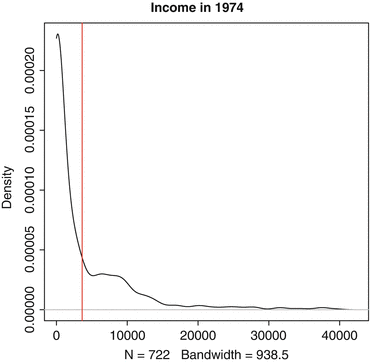

# Estadísticas descriptivas {#Estadísticasdescriptivas}

```{r, eval=knitr::opts_knit$get("rmarkdown.pandoc.to") == "html", results='asis', echo=FALSE}
cat('<hr style="background-color:#03193b;height:2px">')
```

Palabras clave:
- Variable del indicador 
- Tendencia central 
- Marco de datos 
- Tabla de frecuencia 
- Desviación absoluta mediana 

Antes de desarrollar cualquier modelo con un conjunto de datos o intentar extraer alguna inferencia a partir de un conjunto de datos, el usuario primero debe tener una idea de las características de los datos. Esto se puede lograr mediante los métodos de visualización de datos descritos en el Cap. 3 , así como a través de estadísticas descriptivas de la tendencia central y la dispersión de una variable, descritas en este capítulo. Idealmente, el usuario realizará ambas tareas, independientemente de si los resultados se convierten en parte del producto final publicado. Una recomendación tradicional para los analistas que estiman funciones como los modelos de regresión es que la primera tabla del artículo debe describir las estadísticas descriptivas de todas las variables de entrada y la variable de resultado. Si bien algunas revistas han dejado de utilizar el escaso espacio impreso en las tablas de estadísticas descriptivas, un buen analista de datos siempre creará esta tabla por sí mismo. Con frecuencia, esta información puede al menos incluirse en apéndices en línea, si no en la versión impresa del artículo.

A medida que trabajamos con estadísticas descriptivas, el ejemplo de trabajo en este capítulo serán datos centrados en políticas de LaLonde (1986) análisis de la Demostración Nacional de Trabajo Apoyado, un programa de la década de 1970 que ayudó a los desempleados de larga duración a encontrar trabajos en el sector privado y cubrió los costos laborales de su empleo durante un año. Las variables en este marco de datos son:
- **treated:** Variable indicadora de si el participante recibió el tratamiento.
- **age:** Medido en años.
- **education:** Años de educación.
- **black:** Variable indicadora de si el participante es afroamericano.
- **married:** Variable indicadora de si el participante está casado.
- **nodegree:** Variable indicadora de no poseer título de bachillerato.
- **re74:** Ganancias reales en 1974.
- **re75:** Ganancias reales en 1975.
- **re78:** Ganancias reales en 1978.
- **hispanic:** Variable indicadora de si el participante es hispano.
- **u74:** Variable indicadora de desempleados en 1974.
- **u75:** Variable indicadora de desempleados en 1975.

## Medidas de tendencia central {-}
Nuestra primera tarea será calcular las medidas de centralidad, que nos dan una idea de un valor típico de una distribución. Las medidas más comunes de tendencia central son la media, la mediana y la moda. El rango intercuartil, que ofrece el 50% medio de los datos, también es informativo. Para comenzar con algunos cálculos de ejemplo, primero debemos cargar los datos de LaLonde (llamados **LL**). Estos están disponibles como parte del paquete **C**oarsened **E**xact **M**atching (**cem**), del que hablaremos con mayor detalle en el Cap. 8 Al igual que con cualquier otro paquete definido por el usuario, nuestra primera tarea es instalar el paquete: 

```{r, warning=F, message=F}
install.packages("cem")

library(cem)

data(LL)
```

Después de instalar el paquete, cargamos la biblioteca, como tendremos que hacer en cada sesión en la que usemos el paquete. Una vez que se carga la biblioteca, podemos cargar los datos simplemente llamando al comando **data**, que carga este marco de datos guardado del paquete **cem** en la memoria de trabajo. Convenientemente podemos referirnos al marco de datos con el nombre **LL**^{Estos datos también están disponibles en formato separado por comas en el archivo llamado <code>LL.csv</code>. Este archivo de datos se puede descargar del Dataverse en la página vii o del enlace de contenido del capítulo en la página 53.}.

Para todas las medidas de tendencia central que calculamos, supongamos que tenemos una sola variable $x$, con $n$ valores diferentes: $x_{1}, x_{2}, x_{3}, \ldots, x_{n}$. También podríamos ordenar los valores de menor a mayor, que se designa de manera diferente con las *estadísticas* de orden como: $x_{(1)}, x_{(2)}, x_{(3)}, \ldots x_{(n)}$. En otras palabras, si alguien le preguntara por la estadística de segundo orden, le diría el valor de $x_{(2)}$, el segundo valor más pequeño de la variable.

Con una variable como esta, la medida de centralidad más utilizada es la media muestral . Matemáticamente, calculamos esto como el promedio de los valores observados:
$$
\bar{x}=\frac{x_{1}+x_{2}+\cdots+x_{n}}{n}=\frac{1}{n} \sum_{i=1}^{n} x_{i}
(4.1)
$$

Dentro de **R**, podemos aplicar la Ec.(4.1) utilizando la función <code>mean</code>. Entonces, si x en este caso fueran los ingresos que los participantes en la Demostración Nacional de Trabajo Apoyado ganaron en 1974, aplicaríamos la función a la variable <code>re74</code>:

```{r, warning=F, message=F}
mean(LL$re74)
```

**R**  responde imprimiendo <code>[1] 3630.738</code>, por lo que podemos informar la media de la muestra como $\bar{x}=3630.738$.

Por supuesto, es recomendable seguir visualizando los datos utilizando las herramientas del Cap. 3 . Además de calcular la media de las ganancias reales en 1974, también podemos aprender mucho simplemente dibujando una gráfica de densidad. Podríamos hacer esto usando el código de **lattice** descrito en el último capítulo o con un poco más de control de usuario de la siguiente manera: 

```{r, warning=F, message=F}
dens.74<-density(LL$re74,from=0)

plot(dens.74,main="Income in 1974")

abline(v=mean(LL$re74),col="red")
```

En la primera línea, el comando <code>density</code> nos permite calcular la densidad de observaciones en cada valor de ingreso. Con la opción <code>from</code>, podemos especificar que el valor mínimo posible de ingresos es 0 (y la opción <code>to</code> nos habría permitido establecer un máximo). En la segunda línea, simplemente trazamos este objeto de densidad. Por último, usamos <code>abline</code> para agregar una línea vertical donde se encuentra nuestra media calculada de $ 3,630.74.

El gráfico resultante se muestra en la Fig.  4.1 . Esta cifra es reveladora: la mayor parte de los datos están por debajo de la media. La media es tan alta porque un puñado de ingresos muy grandes (que se muestran en la larga cola derecha del gráfico) la están elevando. Con la imagen, rápidamente tenemos una idea de la distribución general de los datos.

<center></center>
**Figura 4.1** Gráfico de densidad de los ingresos reales en 1974 a partir de los datos de la demostración nacional de trabajo con apoyo

Volviendo a las representaciones estadísticas, otra medida común de tendencia central es la *mediana* muestral. Una ventaja de calcular una mediana es que es más robusta a valores extremos que la media. Imagínese si nuestra muestra hubiera incluido de alguna manera a Warren Buffett; nuestra estimación del ingreso medio habría aumentado sustancialmente con una sola observación. La mediana, por el contrario, se movería muy poco en respuesta a una observación tan extrema. Nuestra fórmula para calcular una mediana con datos observados se convierte en las estadísticas de orden que definimos anteriormente:
$$
\tilde{x}= \begin{cases}x_{\left(\frac{n+1}{2}\right)} & \text { cuando } n \text { es par } \\ \frac{1}{2}\left(x_{\left(\frac{n}{2}\right)}+x_{\left(1+\frac{n}{2}\right)}\right) & \text { cuando } n \text { es impar }\end{cases}
(4.2)
$$

Tenga en cuenta que la notación para la mediana está algo dispersa y $\tilde{x}$ es uno de los varios símbolos de uso común. Formalmente, siempre que tenemos un número impar de valores, simplemente tomamos la estadística de orden medio (o el valor medio cuando los datos se ordenan de menor a mayor). Siempre que tengamos un número par de valores, tomamos las dos estadísticas de orden medio y promediamos entre ellas. (Por ejemplo, para las observaciones de diez, divide la diferencia entre $x_{(5)}$ y $x_{(6)}$ para obtener la mediana.) **R** ordenará nuestros datos, encontrar los valores de en medio, y tomar las medias reportar la mediana si simplemente Tipo:

```{r, warning=F, message=F}
median(LL$re74)
```

En este caso, **R** imprime <code>[1] 823.8215</code>, por lo que podemos informar $\tilde{x}=823.8215$ como el ingreso medio para los participantes del programa en 1974. Observe que el valor medio es mucho más bajo que el valor medio, $ 2,806.92 más bajo, para ser exactos. Esto es consistente con lo que vimos en la Fig.  4.1 : Tenemos un sesgo positivo en nuestros datos, con algunos valores extremos que elevan un poco la media. Más adelante, lo verificaremos aún más observando los cuantiles de nuestra distribución.

Una tercera medida útil de tendencia central informa un rango de valores centrales. El rango intercuartil es el 50% medio de los datos. Usando estadísticas de pedidos, calculamos los límites inferior y superior de esta cantidad como:

$$
\mathrm{IQR}_{x}=\left[x_{\left(\frac{\pi}{4}\right)}, x_{\left(\frac{3 \sqrt{R}}{4}\right)}\right]
(4.3)
$$

Las dos cantidades informadas se denominan primer y tercer cuartiles . El primer cuartil es un valor para el cual el 25% de los datos son menores o iguales al valor. Del mismo modo, el 75% de los datos son menores o iguales al tercer cuartil. De esta manera, el 50% medio de los datos cae entre estos dos valores. En **R**, hay dos comandos que podemos escribir para obtener información sobre el rango intercuartil:

```{r, warning=F, message=F}
summary(LL$re74)

IQR(LL$re74)
```

El comando de resumen es útil porque presenta la mediana y la media de la variable en un lugar, junto con el mínimo, el máximo, el primer cuartil y el tercer cuartil. Nuestra salida de **R**se  ve así:

Min. 1er Qu. Mediana Media  3er Qu. Max.

0.0  0.0     823.8   3631.0 5212.0  39570.0

Esto es útil para obtener tres medidas de tendencia central a la vez, aunque tenga en cuenta que los valores de la media y la mediana de forma predeterminada se redondean a menos dígitos de los que informaron los comandos separados. Mientras tanto, el rango intercuartílico se puede leer en la salida impresa como IQR x  = [0, 5212]. Normalmente, diríamos que al menos el 50% de los participantes tenía un ingreso entre $ 0 y $ 5212. En este caso, sin embargo, sabemos que nadie obtuvo un ingreso negativo, por lo que el 75% de los encuestados cayó en este rango. Finalmente, el comando IQR reporta la diferencia entre el tercer y primer cuartil, en este caso imprimiendo: [1] 5211.795 . Este comando, entonces, simplemente informa la dispersión entre la parte inferior y superior del rango intercuartílico, nuevamente con menos redondeo que el que habríamos obtenido al usar los números informados por el resumen .

En la mayoría de las circunstancias, el redondeo y las ligeras diferencias en los resultados que producen estos comandos plantean pocos problemas. Sin embargo, si se desean más dígitos, el usuario puede controlar una variedad de opciones globales que dan forma a la forma en que **R** presenta los resultados con el comando de opciones que se mencionó en el Cap. 1 El argumento de los dígitos determina específicamente el número de dígitos presentados. Entonces, por ejemplo, podríamos escribir:  

```{r, warning=F, message=F}
options(digits=9)

summary(LL$re74)
```

Nuestra salida se vería así:

Min.  1er Qu. Mediana Media    3er Qu.  Max.

0.000 0.000   823.822 3630.740 5211.790 39570.700

Por tanto, podemos ver que las discrepancias son una función del redondeo. Sin embargo, tenga en cuenta que los cambios con el comando de opciones se aplican a todas las salidas de la sesión. Por ejemplo, resulta que si volvemos a ejecutar el comando mean, la salida ahora mostraría incluso más dígitos de los que teníamos antes.

También podríamos obtener un resumen general de todas las variables en un conjunto de datos a la vez simplemente escribiendo el nombre del marco de datos solo en el comando de resumen :

```{r, warning=F, message=F}
summary(LL)
```

Esto informa las mismas estadísticas descriptivas que antes, pero para todas las variables a la vez. Si a alguna observación le falta un valor para una variable, este comando imprimirá el número de valores NA para la variable. Sin embargo, tenga en cuenta que no todas las cantidades informadas en esta tabla son significativas. Para las variables indicadoras como tratada , negra , casada , nodular , hispana , u74 y u75 , recuerde que las variables no son continuas. Básicamente, la media informa la proporción de encuestados que reciben un 1 en lugar de un 0, y el recuento de los valores faltantes es útil. Sin embargo, la otra información no es particularmente informativa.

### Tablas de frecuencia {-}

Para las variables que se miden nominal u ordinalmente, el mejor resumen de información suele ser una tabla simple que muestra la frecuencia de cada valor. En **R**, el comando table nos informa de esto. Por ejemplo, nuestros datos incluyen un indicador simple codificado con 1 si el encuestado es afroamericano y 0 en caso contrario. Para obtener las frecuencias relativas de esta variable, escribimos:

```{r, warning=F, message=F}
table(LL$black)
```

Esto imprime la salida:

0   1

144 578

Por lo tanto, 144 encuestados no son afroamericanos y 578 encuestados son afroamericanos. Con un indicador nominal como este, la única medida válida de tendencia central es la moda , que es el valor más común que toma una variable. En este caso, el valor más frecuente es un 1, por lo que podríamos decir que la moda es afroamericana.

Como otro ejemplo, estos datos miden la educación en años. Medido de esta manera, podríamos pensar en esto como una variable continua. Sin embargo, el número de valores que adquiere esta variable es algo limitado, ya que nadie en la muestra tiene menos de tres o más de 16 años de educación. Por lo tanto, es posible que deseemos ver una tabla de frecuencias para esta variable también. Además, incluso si la media y la mediana son valores informativos, es posible que deseemos calcular la moda para saber cuál es el número más común de años de educación en estos datos. Para calcular la tabla de frecuencias y hacer que **R** devuelva automáticamente el modo, escribimos:

```{r, warning=F, message=F}
table(LL$education)

which.max(table(LL$education))
```

La tabla que vemos es:

3   4   5   6   7   8   9  10  11  12  13  14  15  16

1   6   5   7  15  62 110 162 195 122  23  11   2   1

De un vistazo, pocos encuestados nunca fueron a la escuela secundaria y solo unos pocos tienen más que una educación secundaria. También podríamos escanear la tabla para observar que la moda es de 11 años de educación, lo que describe a 195 encuestados. Sin embargo, si tenemos muchas más categorías de las que tenemos para la educación , hacer esto será difícil. Por lo tanto, introducir nuestra tabla en el comando which.max devuelve qué etiqueta en la tabla tiene la frecuencia máxima . Nuestra impresión resultante es:

11

9

La primera línea, 11 , imprime la etiqueta de valor de la celda con la frecuencia más alta; este es nuestro modo. La segunda línea agrega el detalle adicional de que el valor de 11 es la novena celda de la tabla (un detalle que generalmente podemos ignorar).

Otra forma en que podríamos presentar nuestras frecuencias es en un diagrama de barras basado en la tabla anterior. Podríamos hacer esto con el siguiente código:

```{r, warning=F, message=F}
barplot(table(LL$education),xlab="Years of Education",

     ylab="Frequency",cex.axis=.9,cex.names=.9,ylim=c(0,200))

abline(h=0,col=’gray60’)

box()
```

En la primera línea, especificamos que estamos dibujando un diagrama de barras de la tabla (educación LL $) . Observe que usamos cex.axis y cex.names para reducir el tamaño del texto en los ejes vertical y horizontal, respectivamente. Luego, agregamos una línea de base en 0 y dibujamos un cuadro alrededor de la figura completa. El resultado se muestra en la Fig.  4.2 . Con este gráfico, podemos detectar fácilmente que la barra más alta, nuestra moda, está en 11 años de educación. El gráfico también nos da una idea rápida de la dispersión de los otros valores.
Abrir imagen en nueva ventanaFigura 4.2
Figura 4.2
Distribución del número de años de educación a partir de los datos de la demostración nacional de trabajo con apoyo

Como punto lateral, suponga que un analista no solo quiere una tabla de frecuencias, sino el porcentaje de valores en cada categoría. Esto podría lograrse simplemente dividiendo la tabla por la cantidad de casos y multiplicándola por 100. Entonces, para el porcentaje de encuestados que cae en cada categoría en la variable de educación, escribimos:

```{r, warning=F, message=F}
100*table(LL$education)/sum(table(LL$education))
```

R  luego imprimirá:

         3          4          5          6

 0.1385042  0.8310249  0.6925208  0.9695291

         7          8          9         10

 2.0775623  8.5872576 15.2354571 22.4376731

        11         12         13         14

27.0083102 16.8975069  3.1855956  1.5235457

        15         16

 0.2770083  0.1385042

Este resultado ahora muestra el porcentaje de observaciones que pertenecen a cada categoría.

## Medidas de dispersión {-}
Además de tener una idea del centro de nuestra variable, también nos gustaría saber qué tan dispersas están nuestras observaciones. Las medidas más comunes de esto son la varianza y la desviación estándar, aunque también discutiremos la desviación promedio promedio como una medida alternativa. Comenzando con la varianza de la muestra, nuestra fórmula para esta cantidad es:

$$
\operatorname{Var}(x)=s_{\infty}^{2}=\frac{\left(x_{1}-\bar{x}\right)^{2}+\left(x_{2}-\bar{x}\right)^{2}+\cdots+\left(x_{n}-\bar{x}\right)^{2}}{n-1}=\frac{1}{n-1} \sum_{i=1}^{n}\left(x_{i}-\bar{x}\right)^{2}
(4.4)
$$

En **R**, obtenemos esta cantidad con la función var . Para los ingresos en 1974, escribimos:

```{r, warning=F, message=F}
var(LL$re74)
```

Esto imprime el valor: [1] 38696328 . Por lo tanto, podemos escribir Var ( x ) = 38696328. Por supuesto, la varianza está en una métrica al cuadrado. Dado que es posible que no queramos pensar en el diferencial en términos de “38,7 millones de dólares al cuadrado”, también recurriremos a medidas alternativas de dispersión. Dicho esto, la varianza es una cantidad esencial que alimenta una variedad de otros cálculos de interés.

La desviación estándar es simplemente la raíz cuadrada de la varianza:

$$
\mathrm{SD}(x)=s_{x}=\sqrt{\operatorname{Var}(x)}=\sqrt{\frac{1}{n-1} \sum_{i=1}^{n}\left(x_{i}-\bar{x}\right)^{2}}
(4.5)
$$

Esta simple transformación de la varianza tiene la buena propiedad de volver a poner nuestra medida de dispersión en la escala original. Podríamos tomar la raíz cuadrada de una varianza calculada o permitir que **R** haga todos los pasos del cálculo por nosotros:

```{r, warning=F, message=F}
sd(LL$re74)
```

En este caso, **R** imprime: [1] 6220,637 . Por lo tanto, s x  = 6220. 637. Cuando una variable tiene la forma de una distribución normal (que nuestra variable de ingreso no lo es), una aproximación útil es la regla 68-95-99.7. Esto significa que aproximadamente el 68% de nuestros datos se encuentran dentro de una desviación estándar de la media, el 95% dentro de dos desviaciones estándar y el 99,7% dentro de tres desviaciones estándar. Para el ingreso en 1974, una fuerte concentración de ingresos en $ 0 elimina esta regla, pero con muchas otras variables se mantendrá observacionalmente.

Una medida de dispersión muy diferente es la desviación absoluta mediana . Definimos esto como:

$$
\operatorname{MAD}(x)=\operatorname{median}\left(\left|x_{i}-\operatorname{median}(x)\right|\right)
(4.6)
$$

En este caso, usamos la mediana como nuestra medida de centralidad, en lugar de la media. Luego calculamos la diferencia absoluta entre cada observación y la mediana. Por último, calculamos la mediana de las desviaciones . Esto nos ofrece la sensación de una desviación típica de la mediana. En R,  el comando se escribe:

```{r, warning=F, message=F}
mad(LL$re74)
```

Aquí, **R** devuelve un valor de 1221,398. Al igual que la desviación estándar, está en la escala de la variable original, en dólares. A diferencia de la desviación estándar, esta estadística resulta ser mucho menor en este caso. Una vez más, los valores extremos pueden aumentar las variaciones y las desviaciones estándar, al igual que pueden distorsionar una media. La desviación absoluta mediana, por el contrario, es menos sensible a los valores extremos.

### Cuantiles y percentiles {-}

Como tema final, los cuantiles y percentiles nos permiten tener una idea de la distribución general de una variable. Los cuantiles son la ubicación relativa de los valores de datos en una lista ordenada, escalada [0, 1]. Para un valor q, el cuantil de ese valor sería el estadístico de orden x ( q ⋅  n ) . Los percentiles son lo mismo, escalados [0, 100], por lo que para un valor p, el percentil p sería X(p ⋅ n100). Por tanto, la mediana es el cuantil 0,5 y el percentil 50. Los casos especiales de cuantiles incluyen los cuartiles introducidos previamente (dividiendo los datos en cuatro grupos), quintiles (divididos en cinco grupos) y deciles (divididos en diez grupos).

En **R**, el cuantil de comando puede darnos cualquier cuantil que deseemos. De forma predeterminada, **R** imprime los cuantiles para q  ∈ {0. 00, 0. 25, 0. 50, 0. 75, 1. 00}. Sin embargo, tenemos la opción de especificar los cuantiles que queramos. La sintaxis es:

```{r, warning=F, message=F}
quantile(LL$re74)

quantile(LL$re74, c(0,.1,.2,.3,.4,.5,.6,.7,.8,.9,1))
```

El primer comando imprime nuestros cuantiles predeterminados, aunque los informa con las etiquetas de percentiles reescaladas:

        0%        25%        50%        75%       100%

    0.0000     0.0000   823.8215  5211.7946 39570.6797

Esencialmente, esta información repite la información de cuartiles que el resumen nos proporcionó anteriormente. En nuestra segunda línea de código, agregamos un vector de 11 cuantiles de interés para solicitar deciles, que nos dan los puntos de corte para cada 10% adicional de los datos. Este resultado es:

        0%        10%        20%        30%

    0.0000     0.0000     0.0000     0.0000

       40%        50%        60%        70%

    0.0000   823.8215  1837.2208  3343.5705

       80%        90%       100%

 6651.6747 10393.2177 39570.6797

Esto es revelador, ya que muestra que al menos el 40% de nuestros encuestados tenía un ingreso de $ 0 en 1974. Además, al pasar del percentil 90 al percentil 100 (o máximo), vemos un salto de $ 10,393 a $ 39,570, lo que sugiere que algunos Los valores particularmente extremos se encuentran en el 10% superior de nuestros datos. Por lo tanto, estos datos tienen un sesgo positivo sustancial, lo que explica por qué nuestra mediana calculada es tan diferente de la media.

En este capítulo, hemos cubierto los diversos medios por los cuales podemos calcular las medidas de centralidad y dispersión en **R**. También hemos discutido tablas de frecuencias y cuantiles. Junto con las técnicas de graficación del Cap. 3 , ahora tenemos una gran canasta de herramientas para evaluar y reportar los atributos de un conjunto de datos. En el próximo capítulo, pasaremos a hacer inferencias a partir de nuestros datos. 

## Problemas de práctica {-}

Considere de nuevo Peake y Eshbaugh-Soha (2008) análisis de la cobertura de la política de medicamentos, que se introdujo en los problemas de práctica del Cap. 3 . Recuerde que el archivo de datos separados por comas se llama drugCoverage.csv . Si aún no lo ha descargado, visite Dataverse (consulte la página vii) o el contenido en línea de este capítulo (consulte la página 53). Una vez más, las variables son: un índice de tiempo basado en caracteres que muestra el mes y el año ( año ), la cobertura de noticias sobre drogas ( drugmedia ), un indicador de un discurso sobre drogas que pronunció Ronald Reagan en septiembre de 1986 ( rwr86 ), un indicador de un discurso que pronunció George HW Bush en septiembre de 1989 ( ghwb89 ), el índice de aprobación del presidente ( aprobación ) y la tasa de desempleo ( desempleo ).

1. ¿Qué puede aprender simplemente aplicando el comando de resumen al conjunto de datos completo? ¿Qué salta más claramente de esta salida? ¿Hay algún valor perdido en estos datos?

2. Usando la función media , calcule lo siguiente:
    - ¿Cuál es la media del indicador del discurso de George HW Bush en 1989? Dado que esta variable solo toma valores de 0 y 1, ¿cómo interpretaría esta cantidad?
    - ¿Cuál es el nivel medio de aprobación presidencial? ¿Cómo interpretaría esta cantidad?

3. ¿Cuál es el nivel medio de cobertura de los medios de comunicación sobre temas relacionados con las drogas?

4. ¿Cuál es el rango intercuartílico de cobertura de los medios de comunicación sobre temas relacionados con las drogas?

5. Informe dos tablas de frecuencia:
    - En el primero, informe la frecuencia de los valores del indicador del discurso de Ronald Reagan de 1986.
    - En el segundo, informe la frecuencia de los valores de la tasa de desempleo en un mes determinado.
    - ¿Cuál es el valor modal del desempleo? ¿En qué porcentaje de meses ocurre la moda?

6. ¿Cuáles son la varianza, la desviación estándar y la desviación absoluta mediana para la cobertura de noticias sobre drogas?

7. ¿Cuáles son los percentiles 10 y 90 de aprobación presidencial en este período de tiempo 1977-1992?
 
## Referencias {-}

- LaLonde RJ (1986) Evaluación de las evaluaciones econométricas de programas de formación con datos experimentales. Am Econ Rev 76 (4): 604–620
- Peake JS, Eshbaugh-Soha M (2008) El impacto en el establecimiento de la agenda de los principales discursos televisivos presidenciales. Polit Commun 25: 113-137